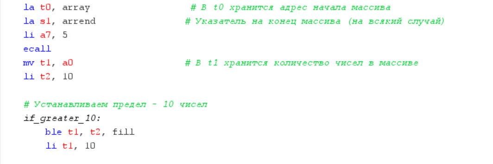
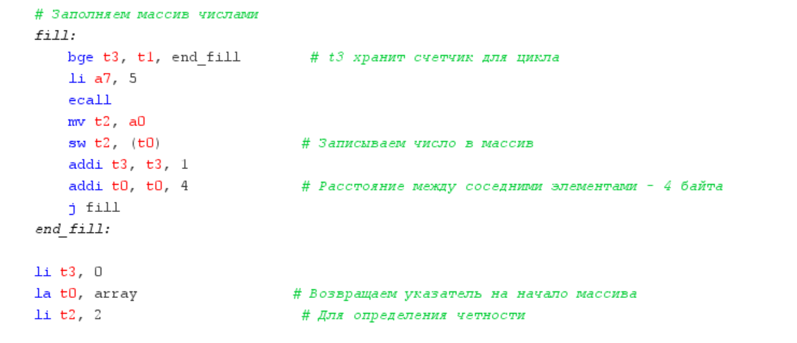
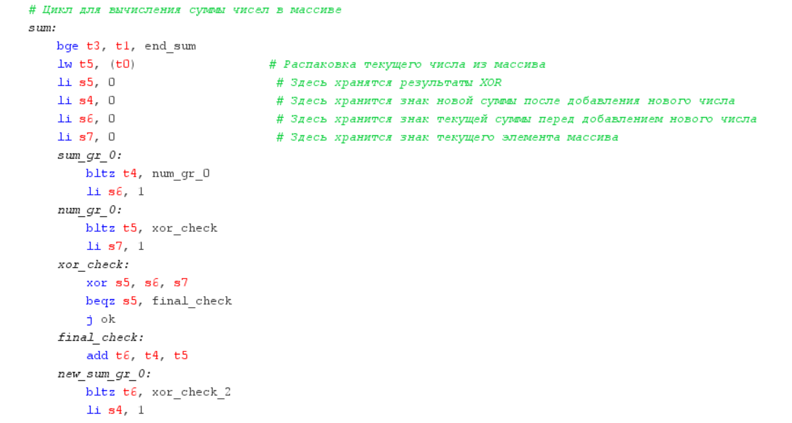
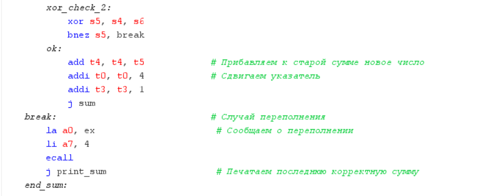
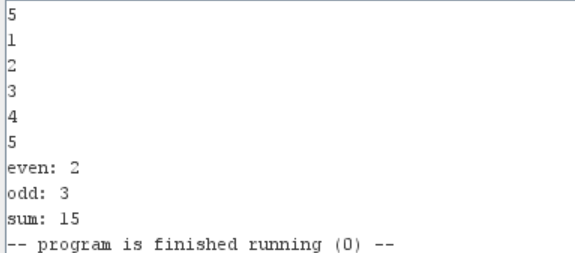
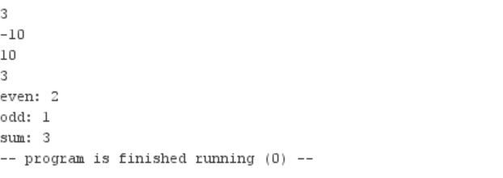
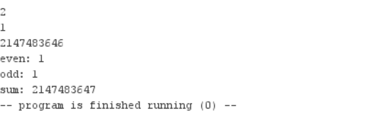
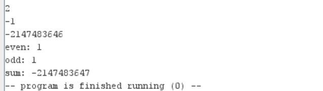

# Бугаков Максим Дмитриевич БПИ226

## Реализация
[Программа](code.asm)

### Объявление массива

### Заполнение массива

### Подсчёт чётных и нечётных чисел

### Сумма массива

## Тесты

## Тесты c переполнением

