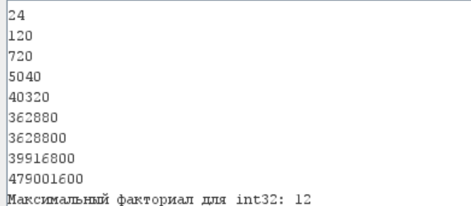

# Бугаков Максим Дмитриевич БПИ226

## Реализация факториала с помощью цикла 

[Программа](default_factorial.asm)
 
1. В основной программе находится цикл, выводящий все факториалы с 1 до переполнения
2. Факториал рассчитывается в подпрограмме **fact**
3. После рассчёта факториала выполняется проверка на переполнение: (n - 1)! > M / n, где n - текущее число, а M = (2^31) - 1. И если произошло переполнение, то в a0 хранится старый факториал (который был выведен на экран самым последним)

### Тест

## Реализация факториала с помощью рекурсии

[Программа](ret_factorial.asm)

Реализация такая же, кроме подпрограммы fact. В ней используется s-регистр, для которого на стеке выделяется 4 байта. Перед возвращением из функции состояние s-регистра восстанавливается. Рекурсивный расчет факториала осуществляется путем вызова функции с помощью jal, где параметр a0 уменьшен на 1. Если a0 равно 1, то происходит переход к метке в основную программу

### Тест

