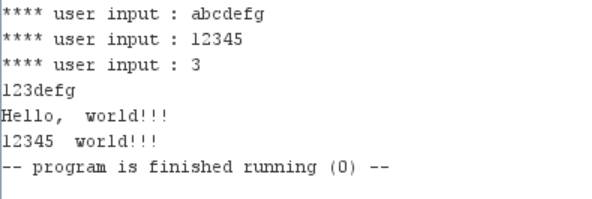

# Бугаков Максим Дмитриевич БПИ226
**Условие:** Написать подпрограмму, осуществляющую копирование строки символов аналогично функции strncpy языка программирования C. Протестировать функцию на различных комбинациях данных. Ознакомиться с функцией можно в системе справки по библиотеке языка C, которая имеется в различных источниках информации. Исходные данные для тестирования задавать как при вводе с консоли, так и с использованием строк символов в разрабатываемой программе (по аналогии с программами, рассмотренными на семинаре).
## Реализация
[Основная программа и подпрограмма strncpy](main.asm)

[Макросы](macros.asm)

#### Программа работает со строками, которые вводятся с консоли, и со строками символов

## Тесты

