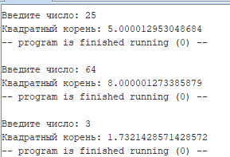
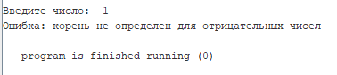

# Бугаков Максим Дмитриевич БПИ226
## Вариант 18
**Условие:** Разработать программу вычисления корня квадратного по итерационной формуле Герона Александрийского с точностью не хуже 0,05%.
### Тесты

