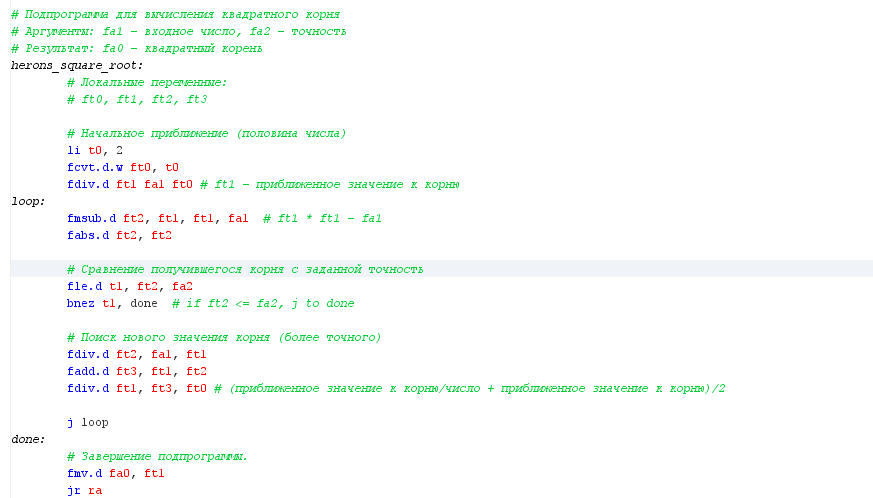

# Бугаков Максим Дмитриевич БПИ226
## Вариант 18
**Условие:** Разработать программу вычисления корня квадратного по итерационной формуле Герона Александрийского с точностью не хуже 0,05%.
### Тесты

### Была реализована подпрограмма "herons_square_root" с передаваемыми параметрами(число и точность) и локальными переменными (данная подпрограмма считает квадратный корень)

