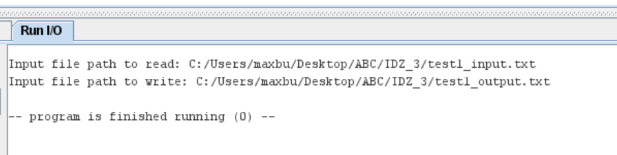
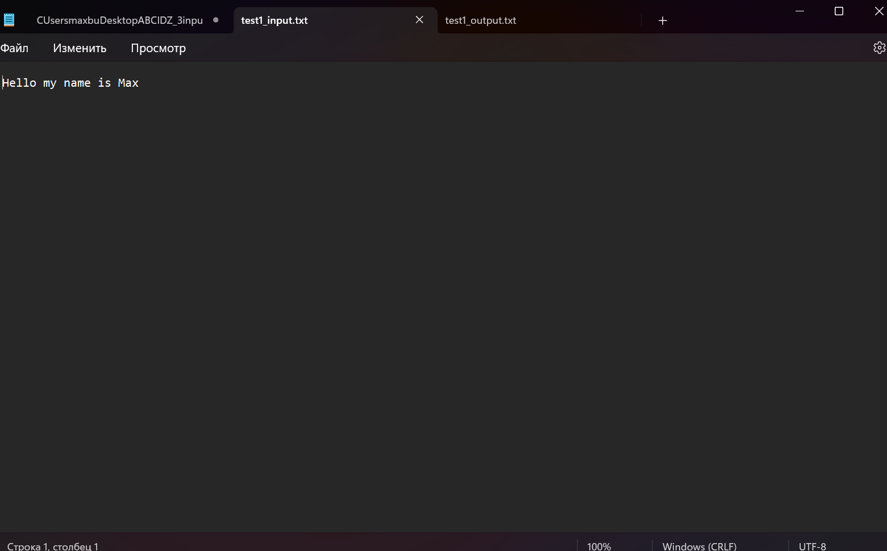
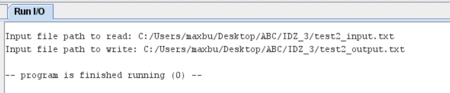
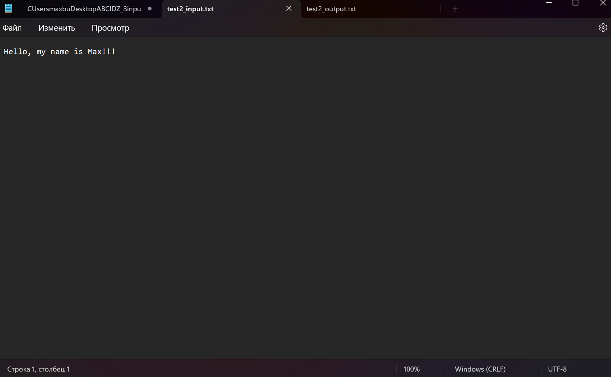
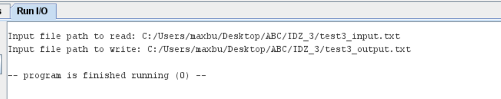

# Бугаков Максим Дмитриевич БПИ226
## Вариант 22
**Условие:** Разработать программу, вычисляющую число вхождений различных знаков препинания в заданной ASCII–строке. Вывод результатов организовать в файл (используя соответствующие преобразования чисел в строки).
## Тесты
### Тест 1

### Тест 2

### Тест 3

## Улучшенная реализация
### Были созданы подпрограммы с передаваемыми параментрами и локальными переменными (process_data, int_to_str, reverse_string, get_string_length)

### Так же были созданы подпрограммы read_data_from_file и write_to_file для чтения и записи данных из файлов

