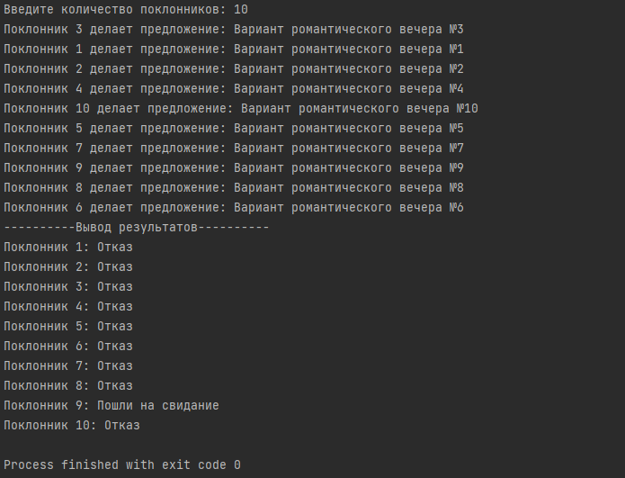
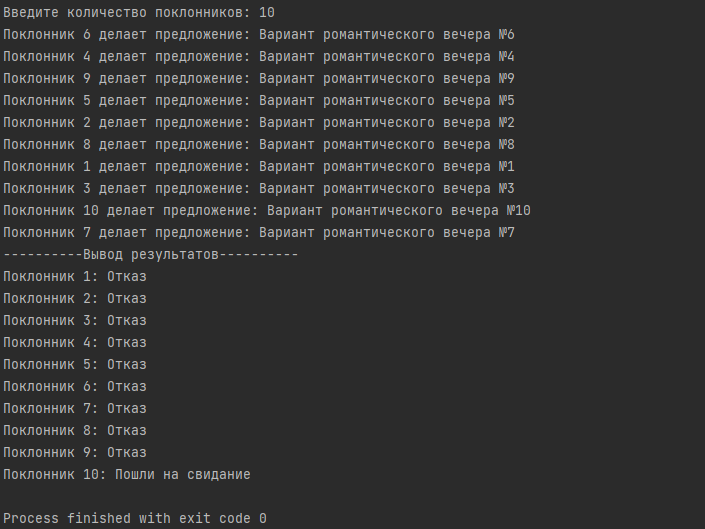

# Бугаков Максим Дмитриевич БПИ226
## Вариант 27
**Условие:** У одной очень привлекательной студентки есть N поклонников. Традиционно в день св. Валентина очень привлекательная студентка проводит романтический вечер с одним из поклонников. Счастливый избранник заранее не известен. С утра очень привлекательная студентка получает N «валентинок» с различными вариантами романтического вечера. Выбрав наиболее заманчивое предложение, студентка извещает счастливчика о своем согласии, а остальных — об отказе. Требуется создать многопоточное приложение, моделирующее поведение студентки. При решении использовать парадигму «клиент–сервер» с активным ожиданием (предполагается, что поклонник не сразу получает ответ, а только после того, как все они сделают запросы, после чего студентка выберет лучшего и разошлет все соответствующие уведомления).
## Реализация
### Введение
Проект представляет собой многопоточное приложение, имитирующее сценарий, в котором одна очень привлекательная студентка получает предложения от N поклонников на проведение романтического вечера в День святого Валентина. Программа использует парадигму «клиент–сервер» с активным ожиданием для моделирования взаимодействий между студенткой и поклонниками.
### Сценарий поведения сущностей
В данном сценарии каждый поклонник (клиент) отправляет уникальное предложение романтического вечера студентке (серверу). Студентка, получив все предложения, выбирает наиболее привлекательное и отправляет ответы: согласие избранному поклоннику и отказ остальным. Все поклонники действуют одновременно, представляя собой отдельные потоки в программе.
### Модель параллельных вычислений
Многопоточность реализована с использованием библиотеки **pthread**. Каждый поток представляет собой поклонника, отправляющего свое предложение. Сервер (студентка) обрабатывает эти запросы. Мьютекс используется для синхронизации доступа к общим ресурсам, таким как вывод сообщений.
### Входные данные
Программа принимает на вход число N — количество поклонников. Это число определяет количество создаваемых клиентских потоков (поклонников) и влияет на сложность выбора для студентки.
### Генерация случайных чисел
Генераторы случайных чисел используются для создания временной задержки в действиях поклонников и для выбора поклонника студенткой. Диапазоны задержек и выбора описаны в программе.
## Результаты работы программы
### Тест 1

### Тест 2

